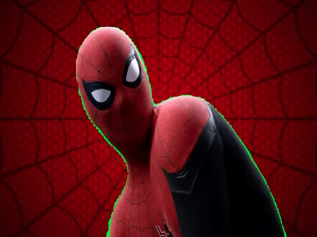

# Chroma Keying Program Using Vlahos Algorithm

Chroma keying (removing or matting a green(blue) screen) is a process used to remove the green (or sometimes blue) background color and replace it with another picture or video.

Here, the main problem is to detect correct edge.

These images are example of bad matting.

Luckily, Vlahos created a new formula, and we can solve this problem.
